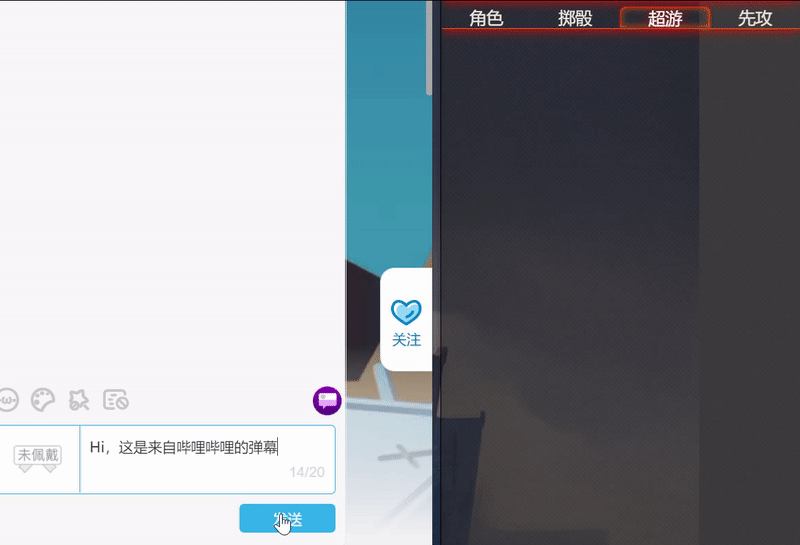

# FVTT 哔哩哔哩直播弹幕监控
[English Readme](./REAME_ENG.md) | [简体中文](./README.md) 

哔哩哔哩直播弹幕同步到 FVTT 的超游聊天之中，同时允许哔哩哔哩直播观众发送查询指令，帮助他们更好地 Get 到当前战役！

## 核心功能
在 MOD 设置里设定哔哩哔哩直播房间号，之后 GM 在房间中时，每一条弹幕和礼物消息都会同步到 FVTT 中。

对于部分系统比如 D&D5e，该 MOD 同样支持发送查询指令（`/HP`, `/PC`），这些指令将会以超游聊天消息的形式，返回查询的结果。如果你同时直播 `/stream` 页面的内容，观众就可以实时看到他们想要知道的信息。 

## 安装
清单文件地址：https://github.com/fvtt-cn/FoundryVTT-BiliLive-Danmaku/releases/latest/download/module.json

推荐同时使用 [Tabbed ChatLog（FVTT 版本）](https://github.com/fvtt-cn/FoundryVTT-Tabbed-Chatlog)。

## 演示

## 赞助
如果希望继续支持该 MOD 的开发以及我的 FVTT 社群工作，可以在[爱发电](https://afdian.net/@mitch)支持该项目。

## 作者
- [hmqgg](https://github.com/hmqgg) from [FVTT-CN](https://github.com/fvtt-cn)

## 鸣谢
- [bilibili-danmaku-client](https://github.com/Tsuk1ko/bilibili-danmaku-client)

## 许可
本项目使用 MIT 许可证，参见 [LICENSE](./LICENSE) 文件。