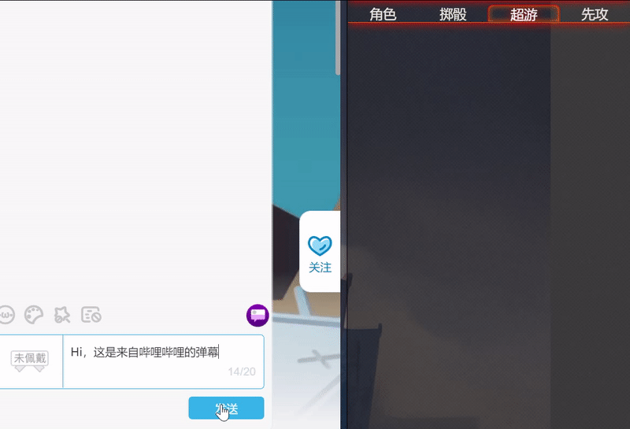

# Foundry VTT Bilibili Live Danmaku Monitor
[English Readme](./REAME_ENG.md) | [简体中文](./README.md)

Sync Bilibili Live Danmakus with Foundry VTT Out of Character Chat Logs and allow Bilibili Live viewers to send Query Commands that help them get into the session interactively!

## Core Features
Set Bilibili Live Room ID in the module settings then every Danmaku and Donar message will sync while you're in the session as GM.

For some systems such as D&D5e, this module also supports Query Commands (`/HP`, `/PC`) which will return the query result as an OOC message. If you're also live streaming `/stream` page, the viewer will get what they want to know in real time.

## Installation
- Manifest URL: https://github.com/fvtt-cn/FoundryVTT-BiliLive-Danmaku/releases/latest/download/module.json
- In Foundry VTT Module Manager, search `bililive`

Recommend you use [Tabbed ChatLog (FVTT Fork)](https://github.com/fvtt-cn/FoundryVTT-Tabbed-Chatlog).

## Demo

## Donation
If you'd like buy me a coffee, you could support this module on [AFDian](https://afdian.net/@mitch).

## Acknowledgements
- [bilibili-danmaku-client](https://github.com/Tsuk1ko/bilibili-danmaku-client)

## License
This project is licensed under the MIT License, see [LICENSE](./LICENSE) for details.